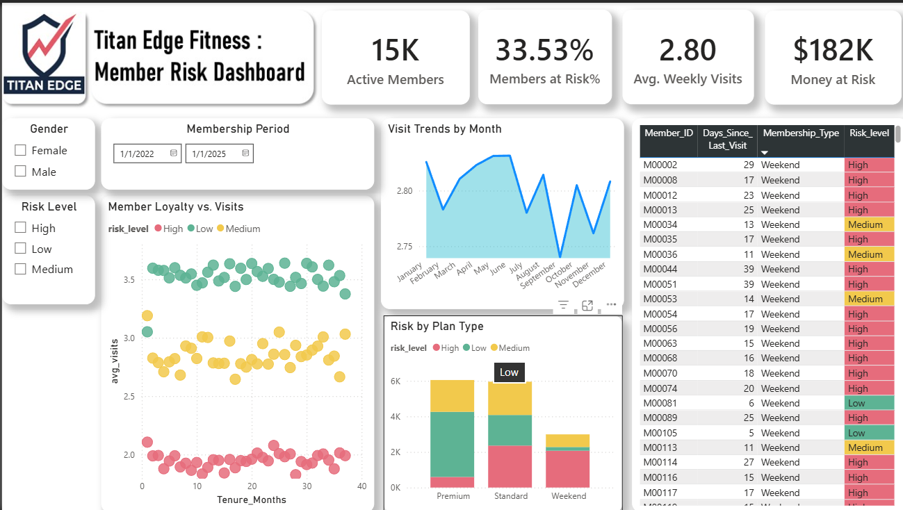

# 🏋️ Titan Edge Fitness – Member Risk Dashboard

A business-focused analytics dashboard designed to identify at-risk gym members, analyze engagement patterns, and estimate revenue exposure using data-driven insights.
# Project Overview

The Titan Edge Fitness – Member Risk Dashboard is a data analytics project that monitors member engagement, predicts churn risk, and quantifies potential revenue loss.

The dashboard provides decision-makers with actionable insights to:

- Detect high-risk members
- Understand visit behavior trends
- Analyze loyalty patterns
- Estimate revenue at risk
- Compare risk across membership plans

This project demonstrates practical Business Intelligence (BI) and data storytelling skills.
# Business Problem:

Gym memberships often suffer from churn due to reduced engagement.

Without early detection:
- Members silently disengage
- Revenue declines gradually
- Retention campaigns become reactive instead of proactive
- This dashboard helps shift from reactive management → predictive retention strategy.

# Dashboard Features:
## 1. KPI Cards
- 15K Active Members
- 33.53% Members at Risk
- 2.80 Average Weekly Visits
- $182K Revenue at Risk

## 2. Visit Trends by Month
- Tracks average visit patterns over time
- Identifies seasonal engagement dips
- Highlights potential churn periods
## 3. Member Loyalty vs Visits (Scatter Plot)
- Shows relationship between tenure (months) and average visits

Color-coded risk levels:
- 🔴 High Risk
- 🟡 Medium Risk
- 🟢 Low Risk

Insight: Members with lower weekly visits show significantly higher churn risk.

## 4.Risk by Plan Type:

Compares churn distribution across:
- Premium
- Standard
- Weekend

Insight: Certain plans show higher concentration of high-risk members.

## 5.Member-Level Risk Table:

Detailed breakdown including:

- Member ID
- Days Since Last Visit
- Membership Type
- Risk Level

Enables targeted retention campaigns.

# 🛠️ Tools & Technologies:
- Power BI
- Data Modeling
- DAX Measures
- Data Visualization
- Business Analytics

# Key Insights:
- 33% of members are currently at risk
- Revenue exposure exceeds $180K
- Reduced visit frequency strongly correlates with higher churn probability
- Weekend plan members show notable risk concentration

# Skills Demonstrated:
- KPI Design
- Risk Segmentation
- Behavioral Analytics
- Revenue Impact Analysis
- Dashboard Design & Layout
- Data Storytelling
- Business-Oriented Thinking
# 📷 Dashboard Preview:

👤 Author
- Ayman Khan
- Aspiring Data Analyst | ML Enthusiast 
